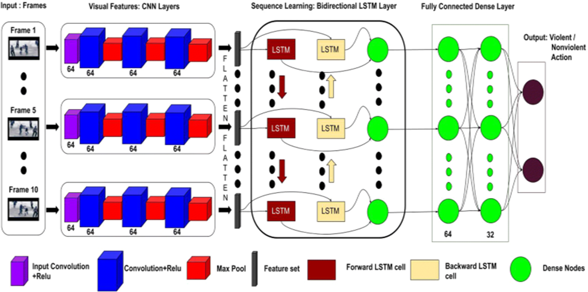

# Real Time Violence Detection using MobileNet and Bi-directional LSTM
### Our approach involves a Convolutional Neural Network Bi-Directional LSTM model architecture to predict violence in the sequential flow of frames. Firstly, we breakdown a video into several frames, then we pass each frame through a Convolutional Neural Network, to extract the information present in that current frame. Then we use a Bi-Directional LSTM layer to compare the information of the current frame once with the previous frames and once with the upcoming frames to identify any sequential flow of violent events. Finally, the classifier is used to identify whether an action is violent or not.

- ### The model consists of a MobileNet Pretrained Model as a spatial feature extractor and Bidirectional LSTM as temporal relation learning method with a focus on the three-factor (overall generality - accuracy - fast response time). The suggested model achieved about 97% accuracy with speed of 16 frames/sec.

- Refrences: [CNN-BiLSTM Model for Violence Detection in Smart Surveillance](https://link.springer.com/article/10.1007/s42979-020-00207-x#Sec15)
